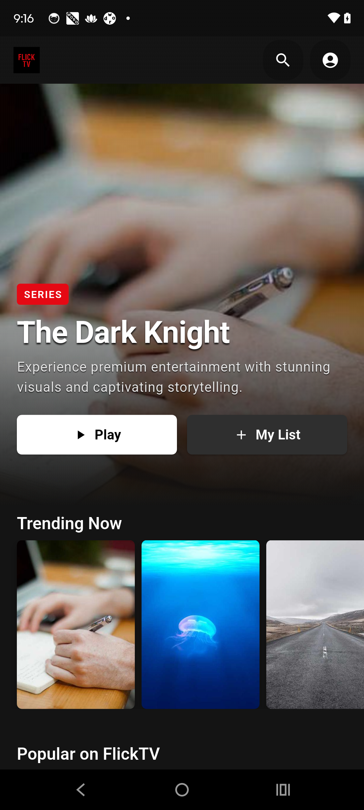
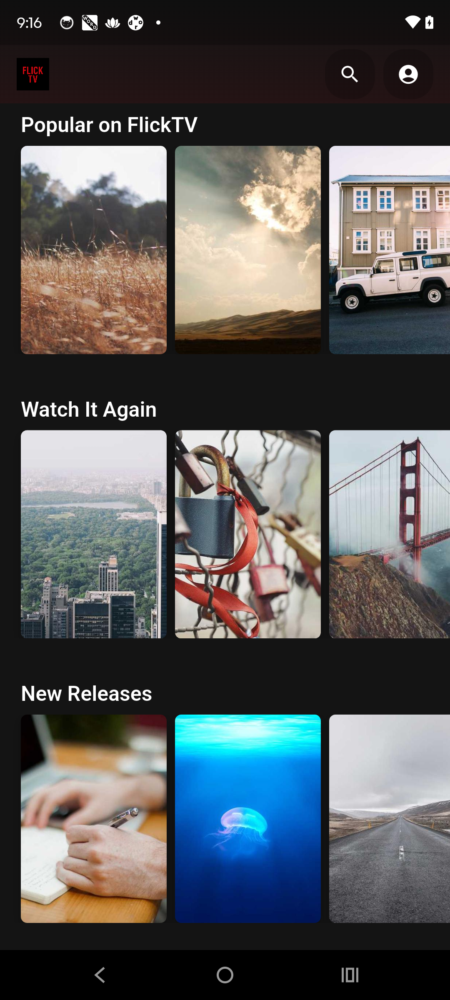
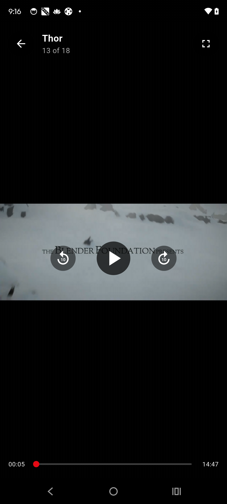
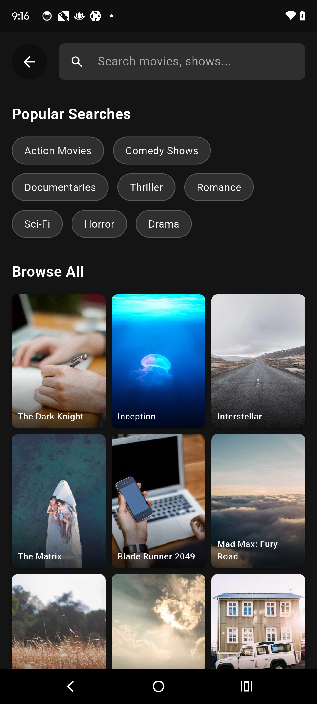

# FlickTV - Flutter OTT Streaming App

<div align="center">
  
</div>

A Netflix-style streaming application built with Flutter, featuring a modern dark UI, video streaming capabilities, search functionality, and user profiles.

## 🛠 Tech Stack

- **Framework**: Flutter 3.29.3
- **Language**: Dart
- **State Management**: BLoC (flutter_bloc)
- **Video Player**: video_player
- **HTTP Client**: http package
- **Architecture**: Clean Architecture with Repository pattern

## 📋 Prerequisites

- **Flutter SDK**: Version 3.0.0 or higher
- **Dart SDK**: Version 2.18.0 or higher
- **Android Studio**: Latest version with Android SDK
- **Java**: JDK 17 or higher

## 📥 Download APK

**Ready to try FlickTV? Download the latest release:**

[](releases/FlickTV-v1.0.1-release-fixed.apk)

- **File Size**: 22.8 MB
- **Version**: 1.0.1 (Fixed network issues)
- **Min Android**: API 21 (Android 5.0+)
- **Target Android**: API 34 (Android 14)

> **Note**: You may need to enable "Install from Unknown Sources" in your Android settings to install the APK.

### 🔧 v1.0.1 Fixes:
- ✅ Added internet permissions for image/video loading
- ✅ Fixed network security configuration
- ✅ Enabled cleartext traffic for HTTP content

## 🚀 Development Setup

### 1. Clone the Repository
```bash
git clone https://github.com/YOUR_USERNAME/flicktv.git
cd flicktv
```

### 2. Install Dependencies
```bash
flutter pub get
```

### 3. Run the Application
```bash
# Run on connected device
flutter run

# Run on specific device
flutter run -d DEVICE_ID
```

### 4. Build for Production
```bash
# Release APK
flutter build apk --release

# Android App Bundle
flutter build appbundle --release
```

## 📁 Project Structure

```
lib/
├── bloc/                   # BLoC state management
├── models/                 # Data models
├── pages/                  # Screen widgets
│   ├── home_page.dart
│   ├── search_page.dart
│   ├── profile_page.dart
│   └── player_page.dart
├── repository/             # Data layer
├── services/               # API services
├── util/                   # Utilities & strings
├── widgets/                # Reusable widgets
└── main.dart              # App entry point
```

## 📱 Screenshots

<div align="center">
  
  
  
  
</div>

### Features Showcase:
- **Home Screen**: Netflix-style interface with multiple content carousels
- **Hero Banner**: Featured content with play and "My List" options
- **Video Player**: Custom player with unified controls and seek functionality
- **Search**: Browse and search through all available content

## 🎯 Features

- Netflix-style home interface with carousels
- Custom video player with unified controls
- Search functionality across all content
- User profile with settings and preferences
- Dark theme with Netflix-inspired design
- Responsive UI for all screen sizes

---

**Built with ❤️ using Flutter**